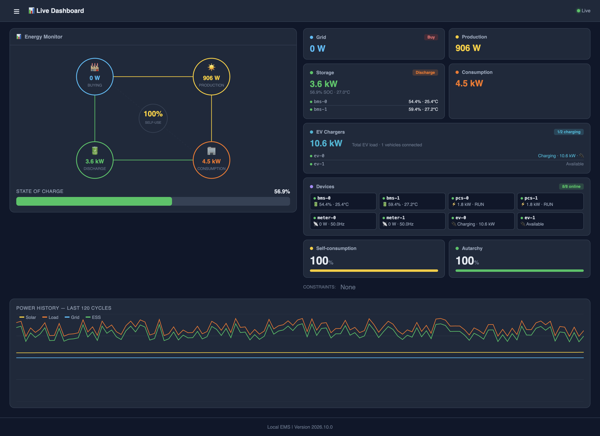
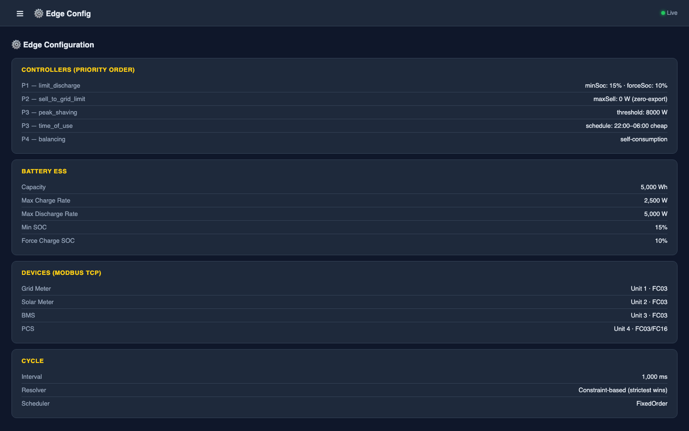
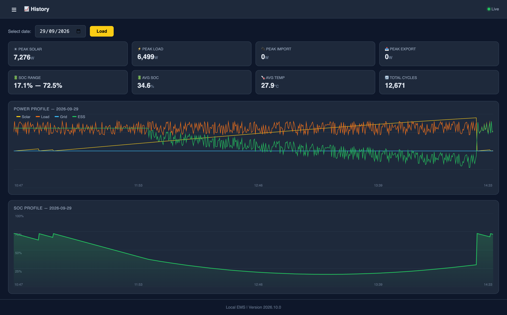
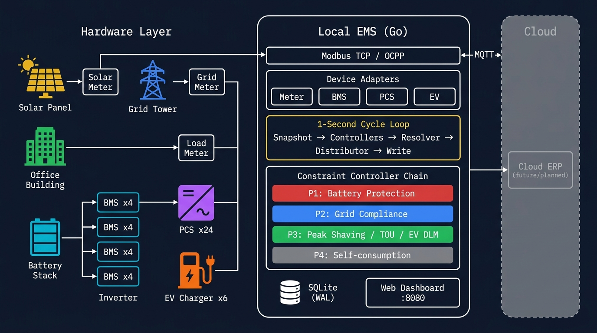

# ⚡ Local EMS — Open-Source Energy Management System

<p align="center">
  <strong>Constraint-based Battery Energy Storage System (BESS) controller written in pure Go</strong>
</p>

<p align="center">
  <a href="#quick-start">Quick Start</a> •
  <a href="#architecture">Architecture</a> •
  <a href="#features">Features</a> •
  <a href="#dashboard">Dashboard</a> •
  <a href="#configuration">Configuration</a> •
  <a href="#contributing">Contributing</a>
</p>

<p align="center">
  
</p>

---

## What is this?

**Local EMS** is a production-grade Energy Management System for Battery Energy Storage Systems (BESS). It controls battery charge/discharge operations using a **Constraint-based Controller Chain** architecture inspired by [OpenEMS](https://openems.io/).

The system runs on-premise with zero cloud dependency, communicates with hardware via **Modbus TCP**, and ships with a full **hardware simulator** for development and testing.

> [!TIP]
> Run the entire system in simulation mode with a single command — no hardware needed.

## Quick Start

### Prerequisites

- **Go 1.27+**
- **GCC** (required for SQLite CGO driver)

> On macOS: `xcode-select --install`
> On Ubuntu: `sudo apt install build-essential`

### Run

```bash
# Clone
git clone https://github.com/vmo/local-ems.git
cd local-ems

# Run in simulation mode (no hardware needed)
go run ./cmd/ems-core --simulate
```

Open **http://localhost:8080** in your browser.

### Run Tests

```bash
go test ./internal/... -count=1
```

All 15 test packages, 50+ test cases.

## Features

### 🔋 Energy Control
| Feature | Description |
|---------|-------------|
| **Zero-export** | Prevents reverse power flow to the grid |
| **Battery Protection** | Stops discharge at SOC < 15%, force-charges at SOC < 10% |
| **Peak Shaving** | Compensates with battery when load exceeds threshold |
| **Time-of-Use** | Charges during off-peak, discharges during peak hours |
| **Self-consumption** | Prioritizes solar, charges battery with surplus |
| **EV Charger DLM** | Dynamic Load Management for EV charging stations |

### 🔌 Device Support
| Device | Protocol | Count (per site) |
|--------|----------|-------------------|
| Power Meter | Modbus TCP | 3 (grid, solar, load) |
| BMS (Battery) | Modbus TCP | 4 |
| PCS (Inverter) | Modbus TCP | 24 |
| EV Charger | Modbus TCP / OCPP | 6 |

### 🏭 Multi-brand PCS
Built-in register profiles for different PCS brands. Plug-in architecture — add your brand by registering a `PCSProfile`:
- Generic (default)
- Sungrow
- Sinexcel
- *Add your own...*

### 📊 Real-time Dashboard
- Live power flow visualization (Grid ↔ Solar ↔ Battery ↔ Load)
- Per-device status and drill-down
- EV Charger monitoring with per-station breakdown
- System health monitoring
- **Multi-language** (English 🇬🇧 / Tiếng Việt 🇻🇳)
- Dark / Light / System theme

<p align="center">
  
</p>

<p align="center">
  
</p>

### 💾 Data & Storage
- SQLite local storage with WAL mode
- Configurable retention (default 7 days, auto-prune)
- MQTT store-and-forward sync to cloud *(planned)*
- Zero data loss — buffered locally even when offline

## Architecture

<p align="center">
  
</p>

### Constraint-based Controller Chain

Unlike traditional if-else control logic, each controller **adds constraints** (power limits). The **ESS Power Resolver** aggregates all constraints and computes the final setpoint. The tightest constraint always wins.

```
┌─────────────────────────────────────────────────────┐
│                 1-Second Cycle Loop                  │
├─────────────────────────────────────────────────────┤
│                                                     │
│  1. Snapshot process image (all device data)         │
│  2. Compute aggregations                            │
│  3. Reset constraints                               │
│  4. Run controllers in priority order:              │
│                                                     │
│     P1  limit_discharge     → Battery protection    │
│     P2  sell_to_grid_limit  → Grid compliance       │
│     P3  peak_shaving        → Cost optimization     │
│     P3  time_of_use         → Cost optimization     │
│     P3  ev_charging (DLM)   → EV load management   │
│     P4  balancing           → Self-consumption      │
│                                                     │
│  5. Resolver: MIN(all MaxDischarge), MIN(all        │
│     MaxCharge) → tightest constraint wins           │
│  6. Distributor: split setpoint across PCS units    │
│     (equal / round-robin / master mode)             │
│  7. Write setpoint to PCS via Modbus                │
│  8. Log & persist to SQLite                         │
│                                                     │
└─────────────────────────────────────────────────────┘
```

### BESS Group Distribution

PCS units can be grouped into BESS groups with different command modes:

- **`individual`** — setpoint split equally across all PCS in the group
- **`master`** — single command sent to master PCS (hardware distributes internally)

### Project Structure

```
.
├── cmd/ems-core/              # Entrypoint (main.go)
├── internal/
│   ├── config/                # YAML config loader + validation
│   ├── devices/               # Device adapters
│   │   ├── device.go          # Device/ControllableDevice interfaces
│   │   ├── bms.go             # BMS adapter (Modbus)
│   │   ├── pcs.go             # PCS adapter (Modbus)
│   │   ├── meter.go           # Power Meter adapter (Modbus)
│   │   ├── evcharger.go       # EV Charger adapter (Modbus)
│   │   ├── pcs_profile.go     # Multi-brand PCS register profiles
│   │   └── aggregator/        # System state aggregation
│   ├── engine/
│   │   ├── cycle/             # 1-second control loop
│   │   ├── scheduler/         # Controller priority scheduler
│   │   ├── resolver/          # Constraint → setpoint resolver
│   │   ├── distributor/       # Power distribution across PCS
│   │   └── controllers/       # Controller implementations
│   │       ├── limit_discharge/
│   │       ├── sell_to_grid_limit/
│   │       ├── peak_shaving/
│   │       ├── time_of_use/
│   │       ├── ev_charging/
│   │       └── balancing/
│   ├── modbus/                # Zero-dependency Modbus TCP client/server
│   ├── simulator/             # Hardware simulator (fake Modbus devices)
│   ├── store/                 # SQLite storage (WAL + auto-retention)
│   ├── health/                # Watchdog & health checks
│   ├── sync/                  # Cloud sync (MQTT, planned)
│   └── ui/                    # Embedded web dashboard
├── config/
│   ├── dev.yaml               # Development config (2 of each device)
│   └── production.yaml        # Production config (full site)
└── docs/
    ├── ems-mvp-plan.md        # Detailed design & roadmap
    └── cloud-erp-plan.md      # Cloud ERP plan (Phase 2)
```

## Configuration

All configuration is done via YAML. See [`config/dev.yaml`](config/dev.yaml) for a complete example.

### Site & Devices

```yaml
site:
  id: site-001
  name: "Solar Farm Alpha"

devices:
  bms:
    - { id: bms-0, host: "192.168.1.10", port: 502, unit: 3 }
  pcs:
    - { id: pcs-0, host: "192.168.1.10", port: 502, unit: 4, brand: sungrow, command_mode: master }
  meter:
    - { id: meter-grid, host: "192.168.1.10", port: 502, unit: 1, role: grid }
    - { id: meter-solar, host: "192.168.1.10", port: 502, unit: 2, role: solar }
  ev_charger:
    - { id: ev-0, host: "192.168.1.20", port: 502, unit: 5 }
```

### Topology (BESS Groups)

```yaml
topology:
  pcc_meter: meter-grid
  solar_meter: meter-solar
  bess_groups:
    - name: "BESS-A"
      bms: [bms-0, bms-1]
      pcs: [pcs-0, pcs-1, pcs-2, pcs-3, pcs-4, pcs-5]
      command_mode: master
```

### Storage & Sync

```yaml
storage:
  driver: sqlite3
  dsn: "file:data/ems.db"
  retention_days: 7
  wal_mode: true

sync:
  enabled: false
  mqtt_broker: "tcp://cloud-broker:1883"
  interval_seconds: 300
```

## Adding a New Controller

1. Create a package under `internal/engine/controllers/<name>/`
2. Implement the `Controller` interface:

```go
type Controller interface {
    ID() string
    Run(DeviceState, *resolver.ConstraintCollector) error
    IsEnabled() bool
}
```

3. Your controller **reads** device state and **adds constraints** — never writes to hardware directly.
4. Register in the scheduler with appropriate priority.
5. Write unit tests.

> [!IMPORTANT]
> All charge/discharge decisions **must** go through the Constraint Resolver. Do NOT bypass the constraint system.

## Adding a PCS Brand

```go
registry := devices.DefaultPCSProfileRegistry()
registry.Register(devices.PCSProfile{
    Brand:             "my-brand",
    ActivePowerSetReg: 100,
    ActivePowerActReg: 102,
    ReactivePowerReg:  104,
    StatusReg:         110,
    RegisterCount:     20,
    ScaleFactor:       10.0,
    CommandMode:       "individual",
    Description:       "My Custom PCS",
})
```

## Tech Stack

| Component | Technology | Notes |
|-----------|-----------|-------|
| Language | Go 1.27 | Single binary, cross-compile |
| Protocol | Modbus TCP | Zero-dependency implementation |
| Storage | SQLite (WAL) | Via `go-sqlite3` (CGO) |
| Config | YAML | Via `gopkg.in/yaml.v3` |
| Dashboard | Embedded HTML/JS | No build step, no npm |
| Dependencies | **2 total** | `go-sqlite3` + `yaml.v3` |

## Roadmap

- [x] Constraint-based controller chain (6 controllers)
- [x] Multi-brand PCS register profiles
- [x] EV Charger integration + DLM controller
- [x] Configurable device topology (BESS groups)
- [x] BESS group master/individual command mode
- [x] SQLite WAL mode + auto-retention
- [x] Real-time web dashboard (English/Vietnamese)
- [ ] Multi-rate hardware polling (200ms / 1s / 5s)
- [ ] MQTT cloud sync (store-and-forward)
- [ ] Config hot-reload
- [ ] Per-device health monitoring
- [ ] OCPP protocol for EV Chargers

## Documentation

- [EMS MVP Plan](docs/ems-mvp-plan.md) — Detailed design, algorithm, and task roadmap
- [Cloud ERP Plan](docs/cloud-erp-plan.md) — Cloud-side fleet management (Phase 2)

## Contributing

Contributions are welcome! Please read the guidelines:

1. Follow [Effective Go](https://go.dev/doc/effective_go) and `go vet` / `golint`
2. Controllers **only add constraints** — never write to hardware directly
3. Every new controller must have comprehensive unit tests
4. Run `go test ./internal/... -count=1` before submitting
5. Commit messages: conventional commits (`feat:`, `fix:`, `refactor:`)

## License

[MIT License](LICENSE)

---

<p align="center">
  Built with ❤️ by <a href="https://github.com/ptit9x">Richard Do</a>
</p>
